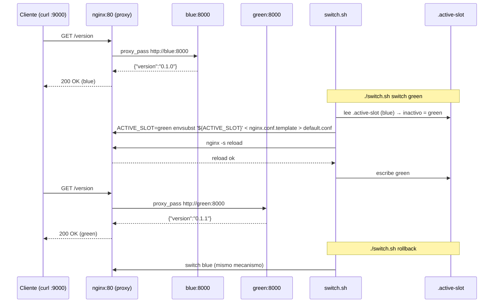

# Demo blue-green con Docker Compose

Demo autocontenido de despliegue **blue-green** con Docker Compose. Dos slots idénticos (`blue` y `green`) detrás de un proxy nginx; solo el proxy publica un puerto en el host. El alumno cambia el tráfico con `switch.sh` y observa `/version` sin reiniciar contenedores de aplicación.

Todo vive en `deploy/blue-green/` y no toca los Environments normales (`deploy/compose.yml` + `deploy/*.env`). No hay CI ni construcción de imágenes: usa imágenes ya publicadas en `ghcr.io/vieitesss/hiss` (públicas, sin `docker login`).

> Código y comentarios en inglés; documentación en español (como en `docs/setup.md`).

## Arquitectura

| Servicio | Imagen | Puerto host | Notas |
|---|---:|---:|---|
| `db` | `postgres:16-alpine` | — (solo `db:5432` interno) | Un único Postgres compartido (simplificación docente) |
| `blue` | `ghcr.io/vieitesss/hiss:${BLUE_TAG}` | — | `healthcheck` idéntico a `deploy/compose.yml` (`/healthz`) |
| `green` | `ghcr.io/vieitesss/hiss:${GREEN_TAG}` | — | Mismo código, distinto tag |
| `proxy` | `nginx:1.27-alpine` | `${BLUE_GREEN_PORT:-9000}:80` | **Único puerto publicado**. Renderiza `nginx.conf.template` con `envsubst '${ACTIVE_SLOT}'` |

Ficheros:

```
deploy/blue-green/
├── compose.yml            # 4 servicios, red única, proyecto hiss-blue-green
├── nginx.conf.template    # proxy_pass http://${ACTIVE_SLOT}:8000 + headers + timeouts
├── switch.sh              # status / switch / deploy / rollback
├── .env.example           # valores por defecto (no secretos)
├── .active-slot           # estado local (blue|green, gitignored)
└── README.es.md           # este fichero
```

`compose.yml` es independiente: `name: ${COMPOSE_PROJECT_NAME:-hiss-blue-green}` y no referencia `deploy/dev.env` ni otros ficheros del repo. Las dos apps comparten `DATABASE_URL` hacia `db:5432` y exponen `APP_VERSION=${BLUE_TAG|GREEN_TAG}`.

El proxy usa `envsubst '${ACTIVE_SLOT}'` (lista explícita) para no vaciar `$host`, `$remote_addr`, etc. Tras renderizar, `proxy_pass` queda literal (`http://blue:8000` o `http://green:8000`); `nginx -s reload` re-resuelve el DNS de Docker. No se necesita `resolver 127.0.0.11` porque no se usa variable de nginx en `proxy_pass`.

## Requisitos

- Docker Engine + Compose v2
- `curl` y `jq` (para las comprobaciones de versión)
- `POSTGRES_PASSWORD` en el entorno (nunca versionada)

## Puesta en marcha (3 comandos)

```sh
# 1. Levantar todo (desde la raíz del repo)
POSTGRES_PASSWORD=changeme docker compose -f deploy/blue-green/compose.yml --env-file deploy/blue-green/.env.example up -d

# 2. Ver estado y versión a través del proxy (único puerto publicado)
./deploy/blue-green/switch.sh status
curl -s http://localhost:9000/version | jq .

# 3. Cambiar el tráfico (corte sin reiniciar apps)
./deploy/blue-green/switch.sh switch green
curl -s http://localhost:9000/version | jq .

# Volver:
./deploy/blue-green/switch.sh switch blue   # o ./deploy/blue-green/switch.sh rollback
```

Personalización sin editar `compose.yml`:

```sh
# Puerto distinto (por defecto 9000, evita colisión con 8001/8002/8003 de deploy/)
BLUE_GREEN_PORT=9001 POSTGRES_PASSWORD=changeme docker compose -f deploy/blue-green/compose.yml up -d

# Tags distintos por slot (por defecto 0.1.0 / 0.1.0)
BLUE_TAG=0.1.0 GREEN_TAG=0.1.1 POSTGRES_PASSWORD=changeme docker compose -f deploy/blue-green/compose.yml up -d

# O vía fichero .env
cp deploy/blue-green/.env.example deploy/blue-green/.env
# edita BLUE_TAG, GREEN_TAG, BLUE_GREEN_PORT...
POSTGRES_PASSWORD=changeme docker compose -f deploy/blue-green/compose.yml --env-file deploy/blue-green/.env up -d
```

Estado local: `deploy/blue-green/.active-slot` guarda `blue` o `green` (por defecto `blue` si no existe). Está en `.gitignore` junto con `deploy/blue-green/nginx.conf` renderizado.

## Uso de `switch.sh`

Script bash (`set -euo pipefail`), compatible con bash 3.2 (macOS) y bash 5 (Linux), muy comentado (comentarios en inglés: es un artefacto docente).

```sh
./deploy/blue-green/switch.sh status              # activo actual (lee .active-slot, por defecto blue)
./deploy/blue-green/switch.sh switch blue|green   # atajo: ./deploy/blue-green/switch.sh green
./deploy/blue-green/switch.sh deploy <tag>        # despliega <tag> en el slot INACTIVO, espera healthy (≤60s), hace switch y verifica /version
./deploy/blue-green/switch.sh rollback            # vuelve al otro color (switch al inactivo)
./deploy/blue-green/switch.sh help
```

Detalles:

- `switch` es **idempotente**: si ya estás en `green` y pides `switch green`, no hace nada.
- `deploy` detecta el slot inactivo, hace `BLUE_TAG=<tag> docker compose up -d <inactive>` (o `GREEN_TAG`), espera `healthy` vía `docker inspect --format '{{.State.Health.Status}}'` con timeout acotado (60 s), hace `switch` y comprueba `curl http://localhost:${BLUE_GREEN_PORT}/version | jq -e '.version == $tag'`.
- `rollback` equivale a `switch` al color opuesto al actual (demuestra que rollback = volver a mover el proxy).
- Todas las operaciones re-renderizan dentro del proxy: `docker compose exec proxy sh -c "ACTIVE_SLOT=<target> envsubst '\${ACTIVE_SLOT}' < /etc/nginx/templates/nginx.conf.template > /etc/nginx/conf.d/default.conf && nginx -s reload"` y actualizan `.active-slot`.

> Si el proxy no está levantado, `switch`/`deploy` avisan: `POSTGRES_PASSWORD=... docker compose -f deploy/blue-green/compose.yml up -d`.

## Observabilidad

El corte es visible en un comando:

```sh
curl -s http://localhost:9000/healthz | jq .
curl -s http://localhost:9000/readyz  | jq .   # hace SELECT 1 real a Postgres
curl -s http://localhost:9000/version | jq .   # {"version":"<tag>"}
```

`docker ps` muestra dos contenedores de app (`hiss-blue-green-blue-1`, `hiss-blue-green-green-1`) y solo uno recibe tráfico.

Prueba de zero-downtime (un bucle sin 5xx durante el switch):

```sh
# En una terminal, tráfico continuo:
while true; do curl -fs http://localhost:9000/version >/dev/null || echo "fail $(date)"; sleep 0.1; done

# En otra, cambia:
./deploy/blue-green/switch.sh switch green
```

Para la clase basta con dos `curl` antes/después del `switch`.

## Diagrama de cutover



## Puntos docentes (para RA3 y RA4)

**1. Ilusión vs. realidad del zero-downtime.** El alumno ve que `curl` no falla durante `nginx -s reload`, pero eso no es “magia”: nginx drena conexiones (`connection draining`) — las peticiones in-flight terminan en el worker antiguo y las nuevas van al nuevo upstream. Si la app tuviese websockets o transacciones largas, habría que configurar `proxy_read_timeout` y `worker_shutdown_timeout`.

**2. Drenaje de conexiones.** `nginx -s reload` no mata conexiones abiertas; lanza nuevos workers con la nueva config y deja que los viejos terminen. En el demo esto se observa porque el bucle de `curl` no ve 502. En producción real con múltiples réplicas, el orquestador (Kubernetes) hace lo mismo con `terminationGracePeriodSeconds`.

**3. DB compartida = restricción de migraciones.** Los dos colores comparten un único `postgres:16-alpine` (simplificación). En un blue-green real, eso obliga a migraciones **backward-compatible**: el esquema debe servir a la versión vieja y a la nueva a la vez. Una migración destructiva (renombrar columna) rompería el color inactivo. De ahí la lección de “expand & contract”.

**Contraste con otras estrategias:**

| Estrategia | Cómo se ve | Qué necesita | Demo |
|---|---:|---|---|
| **Recreate** | `docker compose -f deploy/compose.yml --env-file deploy/prod.env up -d` para un Environment: hay **downtime** visible entre que para el contenedor viejo y arranca el nuevo (el `curl` falla). | Nada más que Compose. | `deploy/` |
| **Rolling** | Va reemplazando réplicas una a una sin downtime total. | Orquestador (K8s `RollingUpdate`, Swarm) que gestione réplicas, health gates y balanceo. | Teoría |
| **Canary** | Un porcentaje del tráfico va a la nueva versión, se analiza y se promueve. | Orquestador o service mesh con pesos, métricas y análisis automatizado. | Teoría |
| **Blue-green (esta demo)** | Dos entornos completos, uno vivo; el cambio es **instantáneo** vía proxy. | Solo Compose + nginx: es visual y cabe en un portátil. | `deploy/blue-green/` |

Rollback en blue-green es `switch` al color anterior — por eso RA4 (rollback) se entiende como “mover el proxy de vuelta”, frente a redesplegar un tag antiguo en `rollback.yml`.

## Verificación y limpieza

La demo no deja contenedores huérfanos. Secuencia recomendada (con tiempos acotados):

```sh
POSTGRES_PASSWORD=changeme docker compose -f deploy/blue-green/compose.yml --env-file deploy/blue-green/.env.example up -d
# Espera healthy ≤60 s (blue/green hacen /healthz)
for svc in blue green proxy; do
  timeout 60 bash -c "until docker inspect --format '{{.State.Health.Status}}' \$(docker compose -f deploy/blue-green/compose.yml ps -q \$svc) 2>/dev/null | grep -q healthy; do sleep 2; done"
done
curl --fail --retry 10 --retry-delay 2 --retry-connrefused http://localhost:9000/version

./deploy/blue-green/switch.sh switch green
curl --fail http://localhost:9000/version | jq -e '.version == "0.1.1"'

./deploy/blue-green/switch.sh switch blue

# Limpieza total (borra también el volumen de Postgres de la demo)
docker compose -f deploy/blue-green/compose.yml down -v
docker ps -a | grep hiss-blue-green || echo "limpio"
docker volume ls | grep hiss-blue-green || echo "volumen limpio"
```

El proyecto existe para que `0.1.0`/`0.1.1` (o cualquier tag publicado en `ghcr.io/vieitesss/hiss`) se puedan `pull` sin autenticación. No se construye nada localmente y no hay job de CI para esta demo (es deliberadamente manual para que el alumno la ejecute).

## Variables de entorno

| Variable | Por defecto | Dónde se usa |
|---|---:|---|
| `POSTGRES_PASSWORD` | *(requerida)* | `db`, `blue`, `green` (`DATABASE_URL`) |
| `BLUE_TAG` | `0.1.0` | `blue` (`ghcr.io/vieitesss/hiss:${BLUE_TAG}` y `APP_VERSION`) |
| `GREEN_TAG` | `0.1.0` | `green` |
| `BLUE_GREEN_PORT` | `9000` | `proxy` (`host:container`) y `switch.sh` (`curl`) |
| `ACTIVE_SLOT` | `blue` | `proxy` (render inicial) |
| `IMAGE` | `ghcr.io/vieitesss/hiss` | `blue`/`green` (permite otro registro) |
| `COMPOSE_PROJECT_NAME` | `hiss-blue-green` | Aislamiento (no colisiona con `hiss-dev`/`hiss-staging`/`hiss-prod` en 8001-8003) |

> **Puertos:** La demo usa `9000` para no colisionar con `8001`/`8002`/`8003` de los tres Environments normales. `8090` aparece en la issue #6 como ejemplo histórico; el valor vigente es `9000` (override con `BLUE_GREEN_PORT`).

## Notas de implementación

- `nginx.conf.template` usa `envsubst '${ACTIVE_SLOT}'` explícito para no sustituir `$host`, `$remote_addr`, etc. `proxy_set_header` y `add_header` (security headers) están incluidos.
- Tras renderizar, `proxy_pass` es literal; `nginx -s reload` vuelve a resolver el DNS de Docker. Si se usase `proxy_pass http://$ACTIVE_SLOT:8000` con variable, haría falta `resolver 127.0.0.11` — se optó por el literal por simplicidad docente.
- `switch.sh` descubre el estado vía `.active-slot` (si se borra, vuelve a `blue`) y respeta `BLUE_GREEN_PORT`.
- El `.gitignore` ignora `deploy/blue-green/.active-slot`, `deploy/blue-green/nginx.conf` y `deploy/blue-green/.rendered.conf` para no versionar estado local.

## Limpieza rápida

```sh
docker compose -f deploy/blue-green/compose.yml down -v
rm -f deploy/blue-green/.active-slot
```
