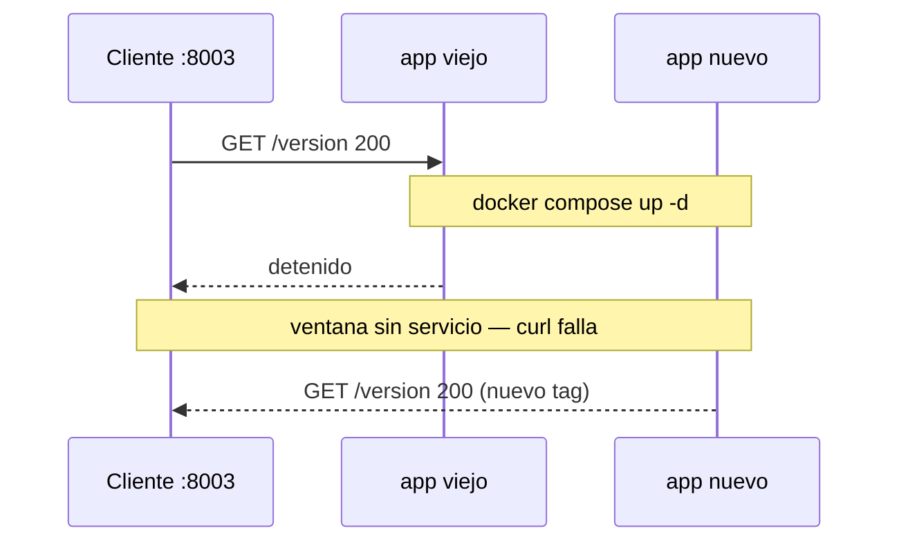
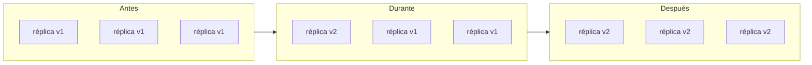
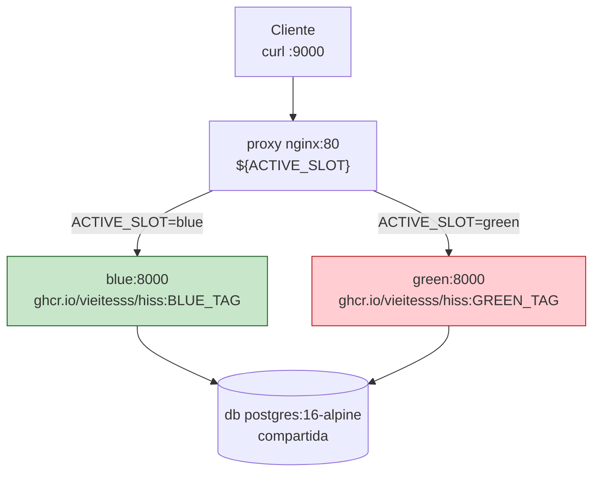
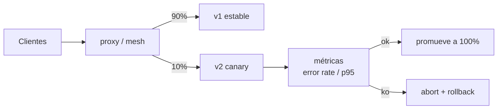

# Estrategias de despliegue

Este documento cubre las cuatro estrategias del temario RA3 y el requisito
de migraciones compatibles hacia atrás. Es teoría anclada a práctica: cada
estrategia se explica con qué necesita, qué downtime implica y dónde
probarla en el repo.

> Demo autocontenida: `deploy/blue-green/` documentada en
> `deploy/blue-green/README.es.md`. Este fichero es la visión de conjunto;
> el README es la guía hands-on de esa demo.

## Resumen

| Estrategia | Downtime | Qué necesita | Dónde probarla |
| --- | --- | --- | --- |
| **Recreate** | sí — segundos de no disponibilidad | solo Compose | `deploy/compose.yml` + `deploy/*.env` |
| **Rolling** | no — reemplazo progresivo | orquestador con réplicas | teoría (K8s `RollingUpdate`) |
| **Blue-Green** | no — corte instantáneo vía proxy | 2 entornos + proxy | `deploy/blue-green/` en `:9000` |
| **Canary** | no — porcentaje de tráfico | orquestador/mesh + métricas | teoría (pesos y análisis) |

Todas despliegan la misma imagen `ghcr.io/vieitesss/hiss:<tag>`; cambia
solo `IMAGE_TAG`/`APP_VERSION` y la forma de mover el tráfico.

## Recreate — parar y arrancar

La estrategia más simple y la que usan `cd-dev.yml`, `cd-staging.yml`,
`cd-prod.yml` y `rollback.yml`: `docker compose up -d` para un
Environment reemplaza el contenedor `app` en el mismo host.

```sh
export POSTGRES_PASSWORD='elige-un-secreto-local'
docker compose --env-file deploy/prod.env -p hiss-prod up -d
# o explícito:
docker compose -f deploy/compose.yml --env-file deploy/prod.env -p hiss-prod pull
docker compose -f deploy/compose.yml --env-file deploy/prod.env -p hiss-prod up -d
# mismo patrón en dev:8001
POSTGRES_PASSWORD='elige-un-secreto-local' docker compose -f deploy/compose.yml --env-file deploy/dev.env -p hiss-dev pull
POSTGRES_PASSWORD='elige-un-secreto-local' docker compose -f deploy/compose.yml --env-file deploy/dev.env -p hiss-dev up -d
curl --fail http://localhost:8001/healthz | jq .
curl --fail http://localhost:8001/readyz  | jq .
curl --fail http://localhost:8001/version | jq .
```

Entre que Compose detiene el contenedor viejo y el nuevo pasa `healthy`,
las peticiones fallan:

```sh
while true; do curl --fail http://localhost:8003/healthz || echo "down $(date)"; sleep 0.5; done
# durante el recreate verás "down"
```

Ventaja: sin infra extra. Desventaja: downtime visible, aunque breve. En
clase, este es el baseline para comparar con zero-downtime.

### Mermaid — Recreate



## Rolling — reemplazo progresivo

Rolling sustituye réplicas una a una detrás de un balanceador. Mientras
una réplica nueva se vuelve `healthy`, las viejas siguen sirviendo
tráfico — no hay downtime total, pero sí un periodo mixto con dos
versiones conviviendo.

Requiere orquestador: Kubernetes `deployment.strategy: RollingUpdate`
(`maxUnavailable`/`maxSurge`), Swarm o similar que gestione réplicas,
health gates y balanceo. Con Compose de un solo contenedor no es
reproducible de forma fiel, por eso en hiss es teoría.

En un rolling real verías:



Rollback en rolling es desplegar la versión anterior como nuevo rollout.

## Blue-Green — dos entornos, un proxy

Blue-green mantiene dos entornos completos (`blue` y `green`) detrás de un
proxy. Solo uno recibe tráfico; el corte es instantáneo vía `nginx -s reload`
sin reiniciar contenedores de aplicación.

### Arquitectura de la demo

`deploy/blue-green/compose.yml` es independiente de `deploy/compose.yml`:

| Servicio | Imagen | Puerto host | Notas |
| --- | --- | --- | --- |
| `db` | `postgres:16-alpine` | — | único Postgres compartido (simplificación) |
| `blue` | `ghcr.io/vieitesss/hiss:${BLUE_TAG}` | — | `healthcheck` idéntico a `deploy/compose.yml` |
| `green` | `ghcr.io/vieitesss/hiss:${GREEN_TAG}` | — | mismo código, distinto tag |
| `proxy` | `nginx:1.27-alpine` | `${BLUE_GREEN_PORT:-9000}:80` | único puerto publicado |

Ficheros: `deploy/blue-green/compose.yml`, `nginx.conf.template`,
`switch.sh`, `.env.example`, `.active-slot` (gitignored).

La demo usa `9000` para no colisionar con `8001`/`8002`/`8003` y
`postgres:16-alpine` frente a `17-alpine` del compose principal — ambas
diferencias se documentan para evitar confusión.

### Hands-on — 3 comandos

```sh
# 1. Levantar (desde la raíz del repo)
POSTGRES_PASSWORD=changeme docker compose -f deploy/blue-green/compose.yml --env-file deploy/blue-green/.env.example up -d

# 2. Ver estado y versión a través del proxy (único puerto publicado)
./deploy/blue-green/switch.sh status
curl -s http://localhost:9000/version | jq .
curl -s http://localhost:9000/healthz | jq .
curl -s http://localhost:9000/readyz  | jq .

# 3. Cambiar el tráfico (corte sin reiniciar apps)
./deploy/blue-green/switch.sh switch green
curl -s http://localhost:9000/version | jq .
./deploy/blue-green/switch.sh rollback
curl -s http://localhost:9000/version | jq .
```

Personalización sin editar `compose.yml`:

```sh
BLUE_GREEN_PORT=9001 POSTGRES_PASSWORD=changeme docker compose -f deploy/blue-green/compose.yml up -d
BLUE_TAG=0.1.0 GREEN_TAG=0.1.1 POSTGRES_PASSWORD=changeme docker compose -f deploy/blue-green/compose.yml up -d
```

`switch.sh` es `bash` `set -euo pipefail` compatible con macOS 3.2 y Linux.
Comandos:

```sh
./deploy/blue-green/switch.sh status              # lee .active-slot, por defecto blue
./deploy/blue-green/switch.sh switch blue|green   # idempotente
./deploy/blue-green/switch.sh deploy <tag>        # despliega en inactivo, espera healthy ≤60s, hace switch y verifica /version
./deploy/blue-green/switch.sh rollback            # vuelve al color opuesto
```

La verificación es `curl --fail http://localhost:9000/version | jq -e '.version == \"<tag>\"'`.

### Mermaid — tráfico blue-green



El corte re-renderiza `nginx.conf.template` con
`envsubst '${ACTIVE_SLOT}'` y `nginx -s reload` — no vacía `$host` ni
`$remote_addr` porque la lista es explícita. Detalle completo y diagrama
de cutover `sequenceDiagram` en `deploy/blue-green/README.es.md`.

### Prueba de zero-downtime

```sh
# terminal 1: tráfico continuo
while true; do curl -fs http://localhost:9000/version >/dev/null || echo "fail $(date)"; sleep 0.1; done
# terminal 2: corta
./deploy/blue-green/switch.sh switch green
# no debes ver "fail" — nginx drena conexiones (connection draining)
```

### Limpieza

```sh
docker compose -f deploy/blue-green/compose.yml down -v
docker ps -a | grep hiss-blue-green || echo "limpio"
docker volume ls | grep hiss-blue-green || echo "volumen limpio"
rm -f deploy/blue-green/.active-slot
```

## Canary — porcentaje de tráfico y análisis

Canary envía un porcentaje pequeño del tráfico a la nueva versión, mide
métricas (tasa de errores, latencia) y promueve automáticamente si todo va
bien. Requiere orquestador o service mesh con pesos, métricas y análisis
automatizado (Flagr, Argo Rollouts, Istio, Linkerd). En hiss es teoría
porque añadir Prometheus y un mesh excede el alcance del curso.



Relación con Feature Flags: un canary a nivel de infra puede combinarse
con `FEATURE_LABEL_FILTERING` a nivel de app para exponer la nueva
funcionalidad solo a un subconjunto de usuarios.

## Migraciones backward-compatible — `0002`

Los dos colores de blue-green comparten una sola `db`. Eso obliga a que
cada migración sirva a la vez a la versión vieja y a la nueva — si el
esquema rompe la versión inactiva, el rollback deja de funcionar.

`app/alembic/versions/0002_create_labels_issue_labels.py` es el ejemplo
del repo:

```python
"""0002: labels + issue_labels association (backward-compatible)
Revises: 0001
Does not alter existing tables — purely additive.
"""
def upgrade() -> None:
    op.create_table("labels", sa.Column("id", sa.Integer(), primary_key=True),
                    sa.Column("name", sa.String(length=100), nullable=False))
    op.create_index("ix_labels_name", "labels", ["name"], unique=True)
    op.create_table("issue_labels",
        sa.Column("issue_id", sa.Integer(), nullable=False),
        sa.Column("label_id", sa.Integer(), nullable=False),
        sa.ForeignKeyConstraint(["issue_id"], ["issues.id"], ondelete="CASCADE"),
        sa.ForeignKeyConstraint(["label_id"], ["labels.id"], ondelete="CASCADE"),
        sa.PrimaryKeyConstraint("issue_id", "label_id"))
```

Es puramente aditiva: `CREATE TABLE labels` y `issue_labels`, sin `ALTER`
ni borrado de columnas. Una versión vieja que no conoce `labels` sigue
funcionando; una nueva usa las tablas si existen. Patrón `expand & contract`:
primero expands (añades tablas/columnas nulables), despliegas, migras datos,
y en una release posterior contracts (eliminas lo viejo) solo cuando ningún
color necesita el esquema antiguo.

Una migración destructiva (renombrar `issues.title` a `issues.name`) habría
roto el `blue` mientras `green` ya esperaba `name`.

## Observabilidad y supervisión

El curso no despliega Prometheus/Grafana/Loki ni ArgoCD — son teoría. La
supervisión honesta del repo es:

```sh
docker compose --env-file deploy/dev.env -p hiss-dev ps
#   NAME                STATUS              PORTS
#   hiss-dev-app-1      Up (healthy)        0.0.0.0:8001->8000/tcp
#   hiss-dev-db-1       Up (healthy)

docker compose --env-file deploy/dev.env -p hiss-dev logs -f app
# ... alembic upgrade head ... Booting worker ... Listening at ...

curl --fail http://localhost:8001/healthz | jq .
curl --fail http://localhost:8001/readyz  | jq .   # SELECT 1 real
curl --fail http://localhost:8001/version | jq .

# blue-green
curl --fail http://localhost:9000/version | jq .
docker compose -f deploy/blue-green/compose.yml ps
```

El dashboard de **GitHub Environments** (`Settings → Environments`) es el
"poor man's monitoring": muestra qué tag está desplegado, quién aprobó
`prod` y el historial de deployments. Para producción real, el temario
apunta a **Prometheus** (métricas), **Grafana** (dashboards),
**Loki** (logs) y **GitOps/ArgoCD** (reconciliación declarativa) como
siguiente paso, sin hands-on en este repo por alcance.

Ver también [`docs/pipeline.md`](pipeline.md), [`docs/environments.md`](environments.md),
[`docs/release-process.md`](release-process.md),
[`docs/secrets-and-config.md`](secrets-and-config.md) y
`deploy/blue-green/README.es.md` para la guía completa de la demo.
