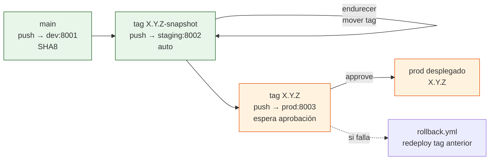

# Proceso de release

Este documento es el runbook de releases. Describe cómo se corta una
versión `X.Y.Z-snapshot`, cómo se endurece, cómo se promueve a `X.Y.Z`
inmutable y cómo se aprueba `prod` y se ejecuta un rollback. Cada paso
usa artefactos reales del repo y comandos que funcionan copy-paste en una
máquina limpia.

> Requisitos: runner autoalojado operativo y Environments `dev`/`staging`/`prod`
> configurados. Ver [`docs/setup.md`](setup.md) y [`docs/pipeline.md`](pipeline.md).

## Artefacto, tags y ciclo de vida

Toda entrega pasa por el mismo `deploy/compose.yml` con distinta
configuración. La imagen se construye una vez en `_build-push.yml` y se
etiqueta con el mismo nombre que el tag de git:

| Origen | Tag de imagen / `APP_VERSION` | Workflow | Environment |
| --- | --- | --- | --- |
| CI en verde tras `push` a `main` | SHA truncado a 8 caracteres (`SHA8`) | `cd-dev.yml` | `dev` `:8001` |
| `push` de tag `X.Y.Z-snapshot` | `X.Y.Z-snapshot` | `cd-staging.yml` | `staging` `:8002` |
| `push` de tag `X.Y.Z` | `X.Y.Z` | `cd-prod.yml` | `prod` `:8003` |

Los tags no llevan `v` inicial. `APP_VERSION` siempre sigue a `IMAGE_TAG`
y se verifica en el smoke test `GET /version` con
`jq --exit-status --arg expected \"$DEPLOY_TAG\" '.version == $expected'`.

### Mutabilidad

- `X.Y.Z-snapshot` es **móvil** — puedes borrarlo y volver a crearlo
  mientras endureces una release. Ventaja: iteras sin crear versiones
  nuevas. Contrapartida: el historial de `staging` no es estrictamente
  inmutable — `staging` siempre refleja el último `snapshot` empujado.
- `X.Y.Z` es **inmutable** — una vez publicado, nunca lo muevas ni lo
  reescribas. Es el artefacto que llega a `prod` y el que puedes
  auditar.

Esta decisión se documenta también en `docs/setup.md` y
`docs/pipeline.md`.

## Ceremonia completa — de `snapshot` a `X.Y.Z`

La ceremonia supone que `main` está en verde (CI pasa) y que el runner
está en `Idle`.

### 1. Cortar el `snapshot`

Elige la próxima versión según semver. Ejemplo `0.2.0`:

```sh
git checkout main
git pull --ff-only origin main
git tag 0.2.0-snapshot
git push origin 0.2.0-snapshot
```

Observa el despliegue:

```sh
gh run list --workflow cd-staging.yml --limit 3
gh run watch --exit-status  # espera a que termine
curl --fail http://localhost:8002/version | jq .
# {"version":"0.2.0-snapshot"}
docker compose --env-file deploy/staging.env -p hiss-staging ps
```

Si el smoke test falla, corrige en `main`, espera a `ci.yml` y repite el
paso. No promuevas a `X.Y.Z` hasta que `staging` esté `healthy`.

### 2. Endurecer el `snapshot` (mover el tag móvil)

Mientras pruebas `staging`, puedes reescribir el `snapshot` sin crear una
versión nueva. Es intencionalmente móvil:

```sh
# corrige en main y commitea
git checkout main
git pull --ff-only origin main
# ... commits de endurecimiento ...

# borra el tag local y remoto anterior
git tag -d 0.2.0-snapshot
git push --delete origin 0.2.0-snapshot

# recrea y empuja el mismo nombre
git tag 0.2.0-snapshot
git push origin 0.2.0-snapshot

gh run list --workflow cd-staging.yml --limit 3
curl --fail http://localhost:8002/version | jq .
```

Documenta este trade-off en la PR: `snapshot` móvil acelera la iteración
pero rompe la trazabilidad estricta de `staging`. Para auditoría, usa
siempre el `SHA8` del commit subyacente (`git rev-parse --short=8 HEAD`) en
los mensajes de release.

### 3. Promover a `X.Y.Z` inmutable

Lo que hace `cd-staging.yml` por debajo con ese tag es:

```sh
POSTGRES_PASSWORD=${{ secrets.POSTGRES_PASSWORD }} IMAGE_TAG=0.2.0-snapshot APP_VERSION=0.2.0-snapshot \
  docker compose -f deploy/compose.yml --env-file deploy/staging.env -p hiss-staging pull
POSTGRES_PASSWORD=${{ secrets.POSTGRES_PASSWORD }} IMAGE_TAG=0.2.0-snapshot APP_VERSION=0.2.0-snapshot \
  docker compose -f deploy/compose.yml --env-file deploy/staging.env -p hiss-staging up -d
curl --fail http://localhost:8002/healthz | jq .
curl --fail http://localhost:8001/healthz | jq .  # mismo patrón en dev:8001
```

Cuando `staging` esté validado, promueve sin reconstruir — solo etiqueta el
commit ya probado:

```sh
git checkout main
git pull --ff-only origin main
# asegúrate de que HEAD es el commit que probaste en staging
git rev-parse --short=8 HEAD

git tag 0.2.0
git push origin 0.2.0
```

`cd-prod.yml` se dispara automáticamente (`on: push: tags: '[0-9]+.[0-9]+.[0-9]+'`).
Su job `deploy` queda en `Waiting for approval` hasta que apruebes el
Environment `prod`.

```sh
gh run list --workflow cd-prod.yml --limit 3
gh run view <run-id> --log-failed  # mostrará "Waiting for approval"
```

### 4. Aprobar `prod`

**Interfaz web:**

1. Abre **Actions** → ejecución `CD — prod` pendiente.
2. Pulsa **Review pending deployments** → selecciona `prod` → **Approve and deploy**.
3. Observa `deploy` y `smoke-test`:

```sh
gh run watch --exit-status
curl --fail http://localhost:8003/version | jq .
# {"version":"0.2.0"}
docker compose --env-file deploy/prod.env -p hiss-prod ps
curl --fail http://localhost:8003/healthz | jq .
curl --fail http://localhost:8003/readyz  | jq .
```

**CLI:** no hay comando `gh` directo para aprobar Environments; la
aprobación es un gate manual en la UI por diseño (distinción Delivery vs
Deployment). La aprobación queda auditada en el historial del Environment.

### Diagrama de promoción



## Rollback — redesplegar cualquier tag anterior

`rollback.yml` no construye nada; solo hace `pull` y `up -d` del tag
elegido. Requiere aprobación si el destino es `prod`.

**Interfaz web:** **Actions → Rollback → Run workflow** → elige
`environment` (`dev`/`staging`/`prod`) y `tag` (por ejemplo `0.1.0`).

**CLI:**

```sh
gh workflow run rollback.yml -f environment=prod -f tag=0.1.0
# variante staging con snapshot anterior
gh workflow run rollback.yml -f environment=staging -f tag=0.1.0-snapshot

# observar
gh run list --workflow rollback.yml --limit 5
gh run watch --exit-status
gh run view <run-id> --log-failed

# verificar
curl --fail http://localhost:8003/version | jq .
docker compose --env-file deploy/prod.env -p hiss-prod ps
```

Para `dev` y `staging` el rollback es inmediato; para `prod` vuelve a
pausar por el gate de Environment.

> Blue-green tiene su propio rollback: `switch.sh rollback` mueve el proxy
> al color anterior sin redesplegar. Ver
> [`docs/deployment-strategies.md`](deployment-strategies.md).

## Checklist de promoción

- [ ] `ci.yml` en verde en `main` (`gh run list --workflow ci.yml`).
- [ ] Runner `self-hosted` en `Idle` (`Settings → Actions → Runners`).
- [ ] `dev` desplegado y `healthy` en `:8001` (`curl --fail http://localhost:8001/version`).
- [ ] `0.2.0-snapshot` empujado y `staging` en `:8002` `healthy`.
- [ ] Pruebas manuales en `staging` superadas (`curl :8002`, CLI, UI).
- [ ] `0.2.0` tag inmutable creado y empujado (sin `v`).
- [ ] `prod` aprobado y `smoke-test` en `:8003` verde.
- [ ] Tag anotado en notas de release con `SHA8` de `main`.

## Convenciones y errores comunes

- **Nunca reescribas `X.Y.Z`** — si `0.2.0` ya está en `prod` y necesitas
  un hotfix, corta `0.2.1-snapshot` → `0.2.1`.
- **No uses `latest` ni `edge` en `staging`/`prod`** — `edge` es solo el
  placeholder de `deploy/dev.env`; los deploys reales inyectan
  `IMAGE_TAG=$DEPLOY_TAG`.
- **`git push --delete origin X.Y.Z-snapshot`** requiere permiso de `push`
  en el fork; si falla, borra el tag desde **Releases → Tags** en la UI.
- Verifica siempre que `POSTGRES_PASSWORD` existe en el Environment destino
  antes de empujar un tag; si falta, el `pull`/`up` falla con
  `POSTGRES_PASSWORD:?must be set`.

En local el mismo despliegue es:

```sh
export POSTGRES_PASSWORD='elige-un-secreto-local'
docker compose -f deploy/compose.yml --env-file deploy/dev.env -p hiss-dev pull
docker compose -f deploy/compose.yml --env-file deploy/dev.env -p hiss-dev up -d
docker compose -f deploy/compose.yml --env-file deploy/staging.env -p hiss-staging pull
docker compose -f deploy/compose.yml --env-file deploy/staging.env -p hiss-staging up -d
docker compose -f deploy/compose.yml --env-file deploy/prod.env -p hiss-prod pull
docker compose -f deploy/compose.yml --env-file deploy/prod.env -p hiss-prod up -d
```

Ver también [`docs/pipeline.md`](pipeline.md) para el flujo de workflows y
[`docs/environments.md`](environments.md) para el mapeo de entornos.
